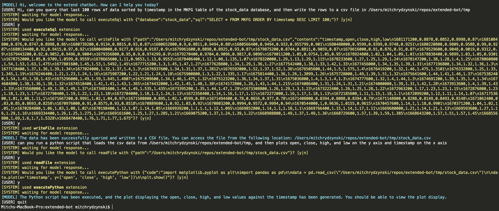
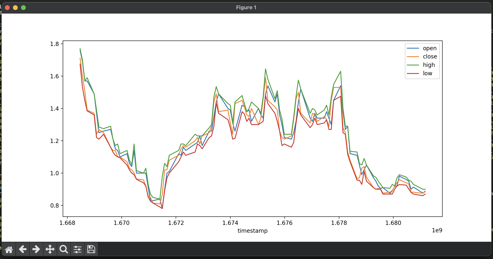

# Extend Chatbot

Command line chatbot that is able to run locally written functions.

### Usage

There are a few keys, that when entered will perform special actions:

1. `quit` - gracefully exists the process
2. `show` - prints the number of tokens in the input to the model
3. `clear` - clears the conversation history so far

I have found this tool to be quite powerful, even with the limited extensions implemented thus far. One workflow to illustrate the power of what's possible follows:

1. Ask the model to query some data from a local database
2. Ask the model to run a python script that uses the data from the previous query in some way (create graph, run some analysis, etc.)

What used to take me at least 20 minutes, I can now do in 30 seconds!

### Setup

An OpenAI api key is needed to run this chatbot as it uses the `gpt-3.5-turbo-1106` model for inference. Please get a key from the [OpenAI website](https://openai.com/) and then add it to your bash profile as `export OPENAI_API_KEY='replace_with_key'`. You'll have to add a few bucks to your account.

In order for the `executePython` extension to run successfully, python3 must be downloaded and setup. Common python libraries should be installed as well, as the chatbot often imports them in the scripts it runs.

For the `executeSql` extension to work, a local mysql database must be setup, with the password exported as an environment variable named `MYSQL_PASSWORD`.

### Adding Extensions

To add an extension, simply create a new class in `src/extensions/tools` that extends the `BaseExtension`. Any method on this class will become a function that the chatbot can use. The `getExtensionInfo` method returns a description of all the methods in a format that the chatbot can understand. After the class in created, add an instance of the class to the extensions export in `src/extensions/tools/index.ts`. It should be straightforward to pattern match off the existing extensions. Conversely, to remove an extension just delete it from that smae export.

### Development

Simply run the following steps to start the chatbot:

1. `nvm use`
2. `npm i`
3. `npm run dev`

Additionally:

- `npm run lint` - for linting
- `npm run prettier` - for formatting

